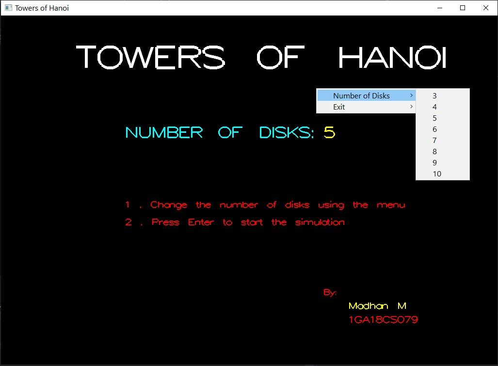
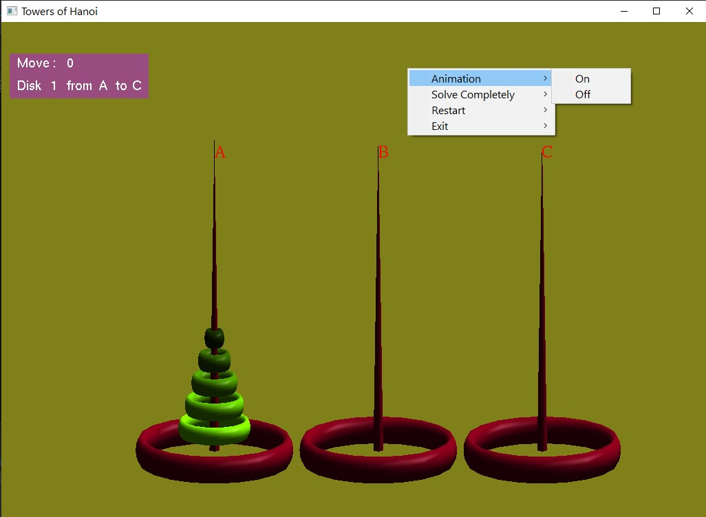
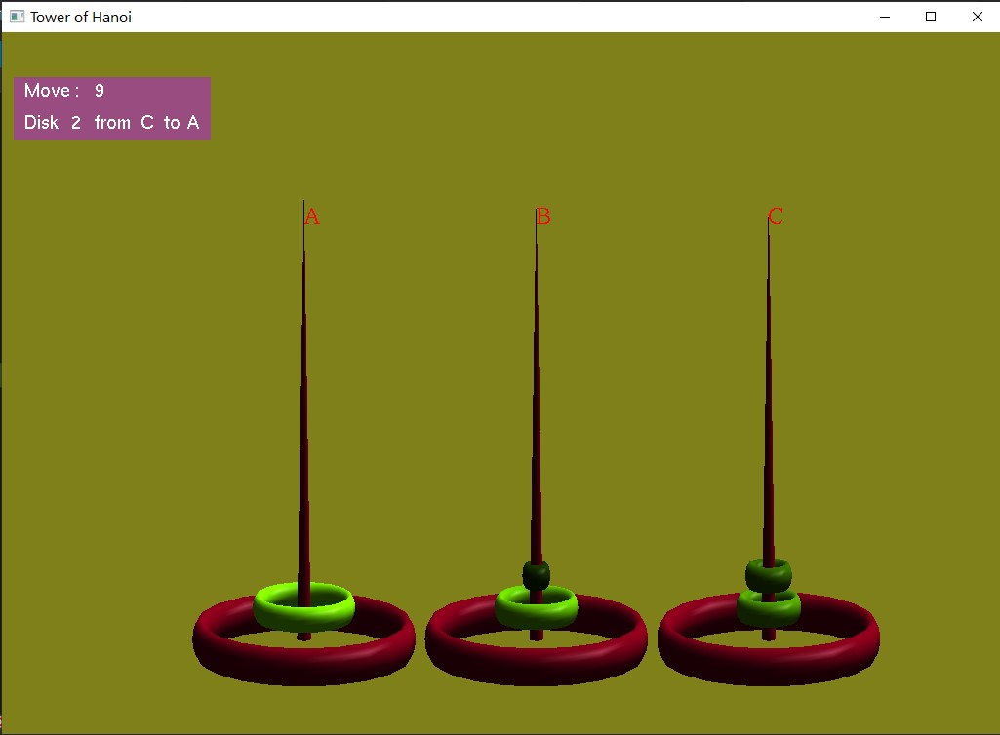
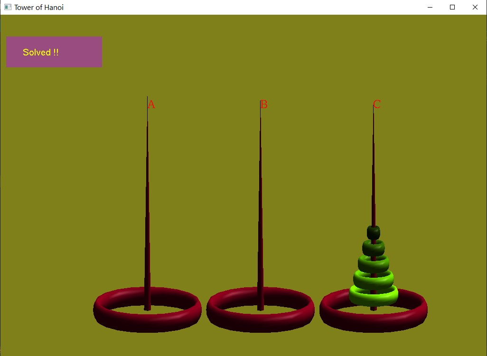

# tower-of-hanois-opengl
Visual representation of Tower of Hanoi problem using OpenGl

click H for Help- which shows the keys to increase and decrease speed of animation

click S to start animation

click + to increase speed

click - to decreaae speed

click Q or Esc to Exit animation

